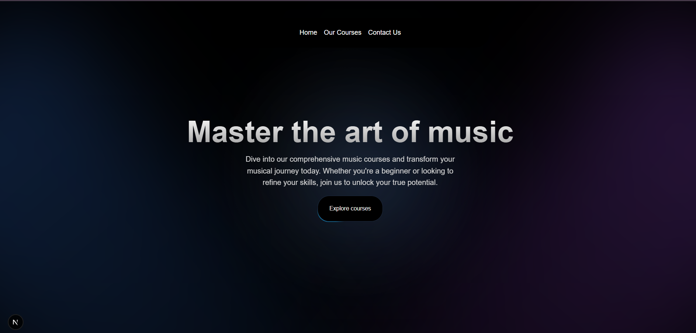
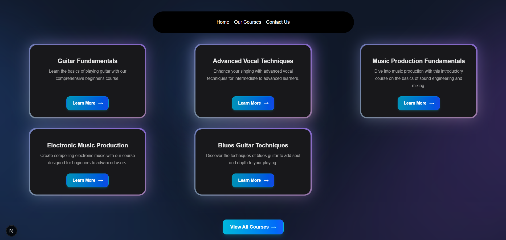
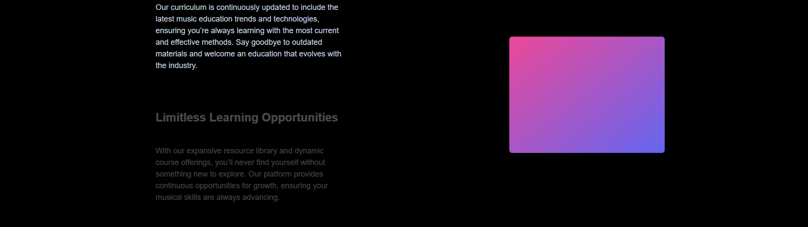
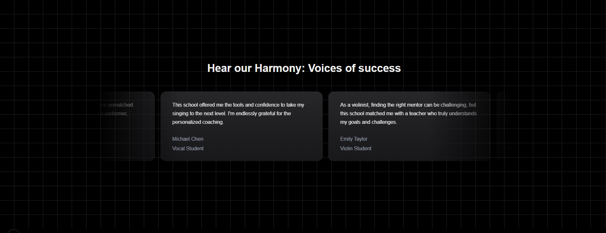
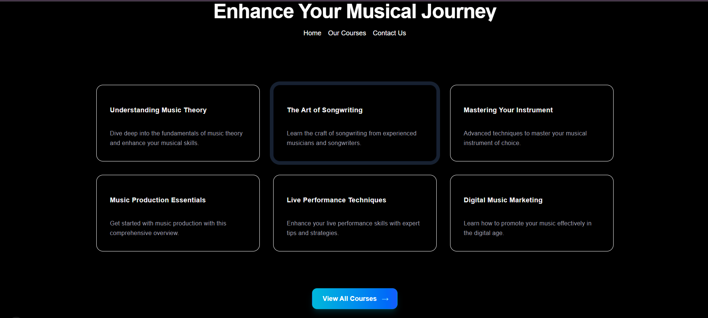
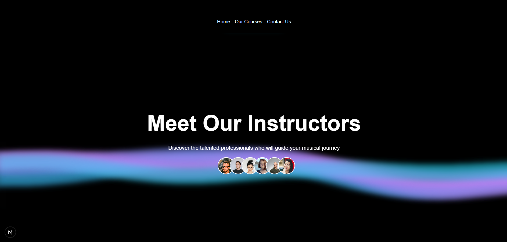

# 🎵 Music School — Modern Music Learning Platform

<div align="center">

### 🎼 Learn. Create. Perform. 🎼

A modern, responsive music-school web application built with **Next.js, TypeScript, Tailwind CSS, and Framer Motion**.

Explore music courses, discover upcoming webinars, read student testimonials, and connect with the music school through a beautiful animated interface.

<br />


</div>

---

## ScreenShot
  
  
  
  
  
  

## 📖 About The Project

**Music School** is a modern frontend web application designed for an online music-learning platform.

The project focuses on creating a premium user experience using modern React and Next.js technologies combined with animated UI components.

Users can:

* 🎸 Explore music courses
* 🎹 View detailed course information
* 🎤 Discover upcoming webinars
* ⭐ Read student testimonials
* 📚 Browse featured learning programs
* 📩 Contact the music school
* 👨‍🎤 Explore instructors and community sections
* ✨ Experience interactive animations
* 📱 Use the website across desktop, tablet, and mobile devices

The project is also designed as a practical demonstration of modern **Next.js + Tailwind CSS UI development**.

---

# ✨ Features

## 🏠 Modern Homepage

The homepage contains multiple interactive sections:

* Hero section
* Spotlight background
* Featured courses
* Why Choose Us section
* Student testimonials
* Upcoming webinars
* Instructor section
* Footer

---

## 🎨 Animated UI

The project uses animation extensively to create a premium experience.

Implemented animations include:

* Hover animations
* Button scaling
* Animated borders
* Moving borders
* Gradient effects
* Spotlight animations
* Infinite moving cards
* 3D card interactions
* Animated arrows
* Glow effects
* Canvas-based wave background

---

## 📚 Courses Page

The courses page displays all available music courses.

Each course contains:

* Course title
* Course description
* Course image
* Interactive 3D card
* Try Now button
* Sign Up button

Example:

```text
All Courses

┌───────────────────────────────┐
│                               │
│       Course Image            │
│                               │
├───────────────────────────────┤
│ Understanding Music Theory    │
│                               │
│ Learn the fundamentals...     │
│                               │
│ Try Now              Sign Up  │
└───────────────────────────────┘
```

---

# 🎓 Course Categories

The application can support different types of music courses such as:

* 🎸 Guitar
* 🎹 Piano
* 🎤 Vocal Training
* 🎻 Violin
* 🎼 Music Theory
* 🎧 Music Production
* ✍️ Songwriting
* 🎤 Live Performance

Courses are loaded from:

```text
src/data/music.json
```

---

# 🎤 Testimonials

The testimonial section uses animated cards to display student experiences.

Example testimonials include:

* Guitar students
* Piano students
* Vocal students
* Violin students
* Music production students

The testimonials are displayed using an animated moving-card interface.

---

# 🎥 Upcoming Webinars

The project includes a featured webinar section with topics such as:

```text
Understanding Music Theory
The Art of Songwriting
Mastering Your Instrument
Music Production Essentials
Live Performance Techniques
Digital Music Marketing
```

Each webinar contains:

* Title
* Description
* URL/slug
* Featured status

---

# 📩 Contact Page

The contact page provides a simple form where users can submit:

* Email address
* Message

The form uses React state management:

```tsx
const [email, setEmail] = useState("");
const [message, setMessage] = useState("");
```

The current implementation logs submitted data to the browser console.

> **Note:** A backend/API can be connected later to actually store or email contact messages.

---

# 🌊 Animated Backgrounds

The project contains multiple animated background components.

### Spotlight Background

Creates animated radial light effects using Framer Motion.

### Grid Background

Provides a responsive grid pattern using Tailwind CSS gradients.

### Wavy Background

Uses HTML Canvas and procedural noise to create animated waves.

Example visual concept:

```text
       ~~~~~~~      ~~~~~~~
   ~~~~~       ~~~~~       ~~~~~
~~~~                         ~~~~
      🎵  MUSIC SCHOOL  🎵
~~~~                         ~~~~
   ~~~~~       ~~~~~       ~~~~~
       ~~~~~~~      ~~~~~~~
```

---

# 🧩 Reusable UI Components

The project follows a reusable component architecture.

Some UI components include:

```text
Button
MovingBorder
Spotlight
BackgroundLines
HoverEffect
Card
CardTitle
CardDescription
CardContainer
CardBody
CardItem
InfiniteMovingCards
ViewAllCourse
```

This makes the application easier to maintain and extend.

---

# 🛠️ Tech Stack

| Technology    | Purpose                |
| ------------- | ---------------------- |
| Next.js       | React framework        |
| React         | UI development         |
| TypeScript    | Type safety            |
| Tailwind CSS  | Styling                |
| Framer Motion | Animations             |
| Next/Image    | Optimized images       |
| Next/Link     | Client-side navigation |
| JSON          | Course data            |
| HTML Canvas   | Wavy animations        |
| ESLint        | Code quality           |
| Git           | Version control        |
| GitHub        | Source control         |

---

# 📂 Project Structure

```text
music-school/
│
├── public/
│   ├── images/
│   └── ...
│
├── src/
│   │
│   ├── app/
│   │   ├── page.tsx
│   │   │
│   │   ├── courses/
│   │   │   └── page.tsx
│   │   │
│   │   ├── contact/
│   │   │   └── page.tsx
│   │   │
│   │   ├── layout.tsx
│   │   └── globals.css
│   │   └── page.tsx
│   │
│   ├── components/
│   │   ├── HeroSection.tsx
│   │   ├── Feature.tsx
│   │   ├── WhyChooseUs.tsx
│   │   ├── UpComingWedinar.tsx
│   │   ├── moveingCard.tsx
│   │   ├── Animated_Tooltip.tsx
│   │   ├── footer.tsx
│   │   ├── Navbar.tsx
│   │   │
│   │   └── ui/
│   │       
│   │       
│   │      
│   │       
│   │       
│   │      
│   │
│   ├── data/
│   │   └── music.json
│   │
│   └── utils/
│       └── cn.ts
│
├── .gitignore
├── next.config.ts
├── package.json
├── tsconfig.json
├── postcss.config.mjs
└── README.md
```

---

# 🚀 Getting Started

## 1. Clone the Repository

```bash
git clone https://github.com/gawaliabhijeet-cell/music_UI.git
```

Move into the project:

```bash
cd music-school
```

---

## 2. Install Dependencies

Using npm:

```bash
npm install
```

Or using yarn:

```bash
yarn install
```

Or using pnpm:

```bash
pnpm install
```

---

## 3. Start Development Server

```bash
npm run dev
```

Open your browser and visit:

```text
http://localhost:3000
```

---

# 📦 Important Dependencies

Install the main dependencies:

```bash
npm install next react react-dom
```

Install Framer Motion:

```bash
npm install framer-motion
```

If Tailwind CSS is not already configured:

```bash
npm install tailwindcss @tailwindcss/postcss
```

---

# 🖼️ Remote Images Configuration

If course images are hosted externally, Next.js requires the remote image domain to be configured.

For example, if your course images use:

```text
i.pinimg.com
```

configure `next.config.ts`:

```ts
import type { NextConfig } from "next";

const nextConfig: NextConfig = {
  images: {
    remotePatterns: [
      {
        protocol: "https",
        hostname: "i.pinimg.com",
      },
    ],
  },
};

export default nextConfig;
```

After modifying the configuration, restart the development server:

```bash
npm run dev
```

---

# 🧠 Architecture

The application follows a component-based architecture.

```text
                    ┌─────────────────┐
                    │     Next.js     │
                    │      App        │
                    └────────┬────────┘
                             │
             ┌───────────────┼───────────────┐
             │               │               │
             ▼               ▼               ▼
        Homepage         Courses Page    Contact Page
             │               │               │
             ▼               ▼               ▼
       UI Components    Course Cards      Contact Form
             │               │
             ▼               ▼
       Framer Motion      JSON Data
             │
             ▼
      Animated Experience
```

---

# 🎨 UI Design

The application uses a modern dark theme with:

* Black backgrounds
* Cyan/blue gradients
* Glassmorphism
* Rounded cards
* Soft shadows
* Animated borders
* Interactive hover states
* Responsive layouts

Main design principles:

```text
Modern
   ↓
Minimal
   ↓
Interactive
   ↓
Responsive
   ↓
Premium
```

---

# 📱 Responsive Design

The application is designed for:

* 📱 Mobile
* 📱 Tablet
* 💻 Laptop
* 🖥️ Desktop

Tailwind responsive utilities are used throughout the project:

```tsx
sm:
md:
lg:
xl:
2xl:
```

Example:

```tsx
className="text-4xl md:text-7xl"
```

---

# ⚡ Performance

The project uses several Next.js features for improved performance:

* Next.js App Router
* `next/image`
* Client/server component separation
* Component reusability
* Optimized CSS
* Lazy loading where appropriate
* Responsive images

---

# 🧪 Development

Run the development server:

```bash
npm run dev
```

Run ESLint:

```bash
npm run lint
```

Create a production build:

```bash
npm run build
```

Start production server:

```bash
npm run start
```

---

# 🔧 Common Issues

## Remote Image Error

If you see:

```text
Invalid src prop
hostname is not configured
```

add the image hostname to:

```text
next.config.ts
```

Example:

```ts
images: {
  remotePatterns: [
    {
      protocol: "https",
      hostname: "i.pinimg.com",
    },
  ],
},
```

Then restart Next.js.

---


# 🔮 Future Improvements

The current project is primarily a frontend application. Future versions can include:

### 🔐 Authentication

* User registration
* Login
* Logout
* JWT authentication
* Protected courses

### 💳 Payments

* Course purchasing
* Payment gateway
* Order history
* Premium courses

### 🎓 Student Dashboard

* Enrolled courses
* Course progress
* Completed lessons
* Certificates

### 🗄️ Backend

Possible backend stack:

```text
Next.js / Node.js
        ↓
     Express
        ↓
     MongoDB
        ↓
 Authentication
        ↓
     REST API
```

### 📧 Contact System

Connect the contact form to:

* Backend API
* Email service
* Database
* Admin dashboard

### 📹 Video Courses

Add:

* Video lessons
* Progress tracking
* Course chapters
* Video player
* Downloadable resources

---

# 🔐 Security Improvements

For production, the following should be implemented:

* Server-side form validation
* Rate limiting
* Input sanitization
* Authentication
* Authorization
* Secure environment variables
* API validation
* CSRF protection where applicable
* Secure database access

Never commit secrets:

```text
.env
.env.local
.env.production
```

Add them to `.gitignore`.

---

# 🌱 Environment Variables

If environment variables are required later, create:

```text
.env.local
```

Example:

```env
NEXT_PUBLIC_API_URL=
DATABASE_URL=
NEXT_PUBLIC_APP_URL=
```

Never commit real API keys or passwords to GitHub.

---

# 🗺️ Roadmap

* [x] Responsive homepage
* [x] Hero section
* [x] Animated backgrounds
* [x] Course listing
* [x] 3D course cards
* [x] Testimonials
* [x] Upcoming webinars
* [x] Contact page
* [x] Responsive UI
* [x] Framer Motion animations
* [ ] Course details page
* [ ] Authentication
* [ ] Student dashboard
* [ ] Backend API
* [ ] MongoDB integration
* [ ] Payment integration
* [ ] Course progress tracking
* [ ] Admin dashboard
* [ ] Online video lessons
* [ ] Certificate generation

---

# 🤝 Contributing

Contributions are welcome.

### 1. Fork the repository

```bash
git fork
```

### 2. Clone your fork

```bash
git clone https://github.com/gawaliabhijeet-cell/music_UI.git
```

### 3. Create a branch

```bash
git checkout -b feature/new-feature
```

### 4. Make your changes

```bash
git add .
```

### 5. Commit

```bash
git commit -m "feat: add new feature"
```

### 6. Push

```bash
git push origin feature/new-feature
```

### 7. Create a Pull Request

Open a pull request on GitHub.

---

# 📜 License

This project is available for educational and personal development purposes.

If you plan to use this project commercially, review and add an appropriate open-source license.

---

# 👨‍💻 Author

**Abhijeet Gawali**

Computer Engineering Student
Full-Stack Web Development Learner

### Skills & Technologies

```text
HTML
CSS
JavaScript
TypeScript
React
Next.js
Tailwind CSS
Framer Motion
Node.js
Express.js
MongoDB
Git
GitHub
REST APIs
```

---

# ⭐ Support

If you found this project useful, consider giving it a ⭐ on GitHub.

It helps support the project and encourages further development.

---

<div align="center">

### 🎵 Learn Music. Build Skills. Create Something Amazing. 🎵

**Made with ❤️ using Next.js and React**

</div>
```
